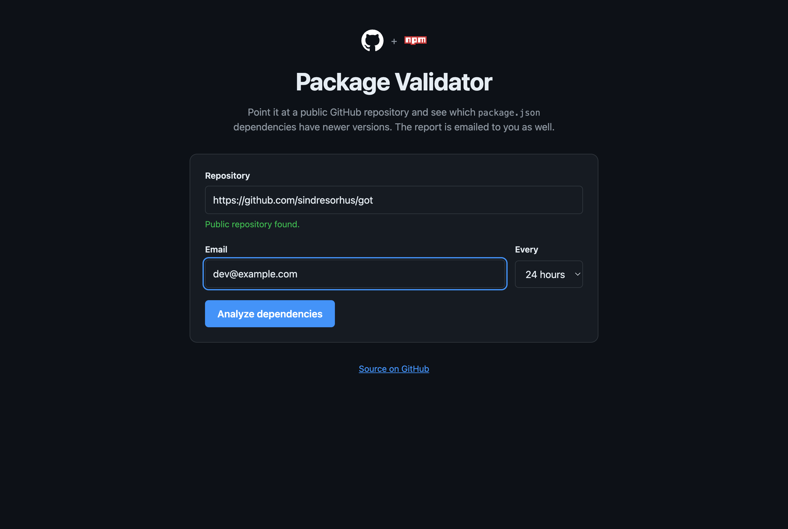
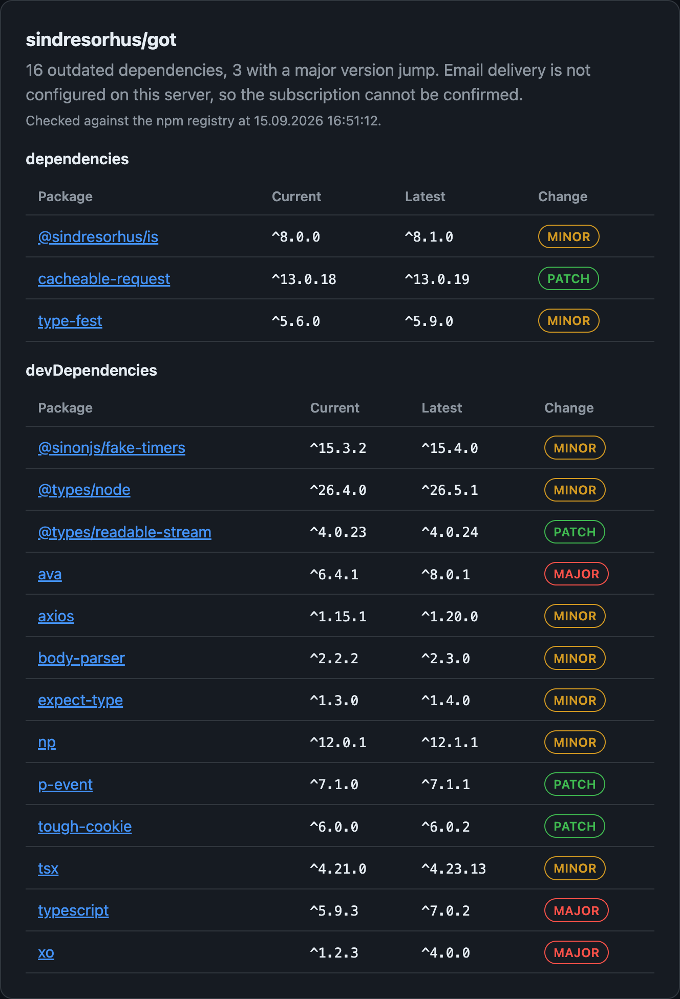
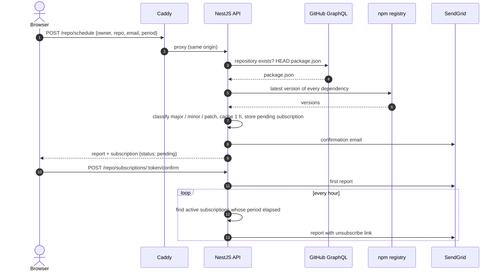

# Package Validator

[](https://github.com/mmayadag/package-validator/actions/workflows/ci.yml)
[](https://github.com/mmayadag/package-validator/actions/workflows/codeql.yml)
[](https://mmayadag.github.io/package-validator/)


Point it at a public GitHub repository and get a report of which `package.json` dependencies have newer versions on npm, in the browser and, after confirming your address, by email every 6, 12 or 24 hours.

## Screenshots

| Check a repository | Report |
|---|---|
|  |  |

## How it works



## Architecture

[](https://mmayadag.github.io/package-validator/)

The browser talks to a single origin. Caddy serves the Svelte bundle and proxies `/repo/*` to the NestJS API, which reads `package.json` from GitHub's GraphQL API, checks every dependency against the npm registry and optionally sends the report through SendGrid. The interactive diagram is generated from [`docs/architecture.json`](docs/architecture.json) with [archify](https://github.com/tt-a1i/archify) and published by the [Pages workflow](.github/workflows/pages.yml).

| Directory | Role | Stack |
|---|---|---|
| [`api/`](api) | REST API | NestJS 12 · TypeScript 6 (ESM, strict) · graphql-request · npm-check-updates · SendGrid · Vitest |
| [`ui/`](ui) | Single-page app | Svelte 5 (runes) · TypeScript · Vite |
| [`docs/`](docs) | Architecture diagram published to GitHub Pages | archify |

## Quick start

Requires Docker with Compose.

```bash
make up          # creates .env on the first run, then builds and starts the stack
```

Set `TOKEN` in `.env` to a GitHub token, run `make up` again and open http://localhost:8080.

| Command | Description |
|---|---|
| `make up` | Build the images and start the stack in the background |
| `make down` | Stop and remove the containers |
| `make logs` | Follow the logs |
| `make ps` | Container status (the UI waits for a healthy API) |

Without `make`: `cp .env.example .env && docker compose up -d --build`.

## Development

Requires Node.js 24.15+ (see [`.nvmrc`](.nvmrc)) and Yarn 1 for the API.

```bash
make install     # api: yarn install, ui: npm ci
make lint        # oxlint + tsc for the API, svelte-check for the UI
make test        # API unit + e2e tests, UI tests

cd api && yarn start:dev   # http://localhost:3288
cd ui && npm run dev       # http://localhost:5173, /repo proxied to the API
```

## API

| Method | Path | Body | Response |
|---|---|---|---|
| `GET` | `/health` | | `{ "status": "ok" }` |
| `GET` | `/repo/isValid/:owner/:repo` | | `{ "valid": boolean }` |
| `POST` | `/repo/isValid` | `{ owner, repo }` | `{ "valid": boolean }` |
| `GET` | `/repo/details/:owner/:repo` | | Report, `404` unknown repo, `422` no `package.json` |
| `POST` | `/repo/schedule` | `{ owner, repo, email, period: 6 \| 12 \| 24 }` | Report and a pending subscription; a confirmation email is sent |
| `POST` | `/repo/subscriptions/:token/confirm` | | Activates the subscription and sends the first report |
| `DELETE` | `/repo/subscriptions/:token` | | `204`, `404` unknown token |

Swagger UI is served at `/docs` (http://localhost:8080/docs with Docker) and the OpenAPI document at `/docs/openapi.json`. Response shapes, status codes and module layout are documented in [`api/README.md`](api/README.md).

## Configuration

Copy [`.env.example`](.env.example) to `.env`. Only `TOKEN` is required; the report is emailed when both `SENDGRID_API_KEY` and `EMAIL_FROM` are set. The API validates its environment at startup and refuses to start with invalid values. All variables are listed in [`api/README.md`](api/README.md#configuration).

## Project structure

```
.
├── api/                  NestJS API
│   ├── src/
│   │   ├── config/       typed, validated environment
│   │   ├── github/       GraphQL client
│   │   ├── dependencies/ npm-check-updates wrapper
│   │   ├── report/       HTML and text rendering
│   │   ├── email/        SendGrid delivery
│   │   ├── repo/         routes, DTOs and use case
│   │   └── health/       liveness probe
│   └── test/             e2e tests
├── ui/                   Svelte 5 SPA served by Caddy
├── docs/                 architecture diagram (GitHub Pages)
├── docker-compose.yml
└── Makefile
```

## Contributing

See [CONTRIBUTING.md](CONTRIBUTING.md). Work is tracked as issues on the [project board](https://github.com/users/mmayadag/projects/5); commits follow [Conventional Commits](https://www.conventionalcommits.org/) with the issue number as the scope, for example `feat(#4): restructure the API into modules`, and [release-please](https://github.com/googleapis/release-please) turns them into releases and the [changelog](CHANGELOG.md). [CodeQL](.github/workflows/codeql.yml) scans every push and pull request. [Dependabot](.github/dependabot.yml) opens grouped update pull requests every Monday for both apps, GitHub Actions and the Docker base images. See [`SECURITY.md`](SECURITY.md) for reporting vulnerabilities.

## History

`api/` and `ui/` started as separate repositories ([package-validator-api](https://github.com/mmayadag/package-validator-api), [package-validator-ui](https://github.com/mmayadag/package-validator-ui)) and were merged with `git subtree`, so their full history is preserved.

## License

[MIT](LICENSE)
